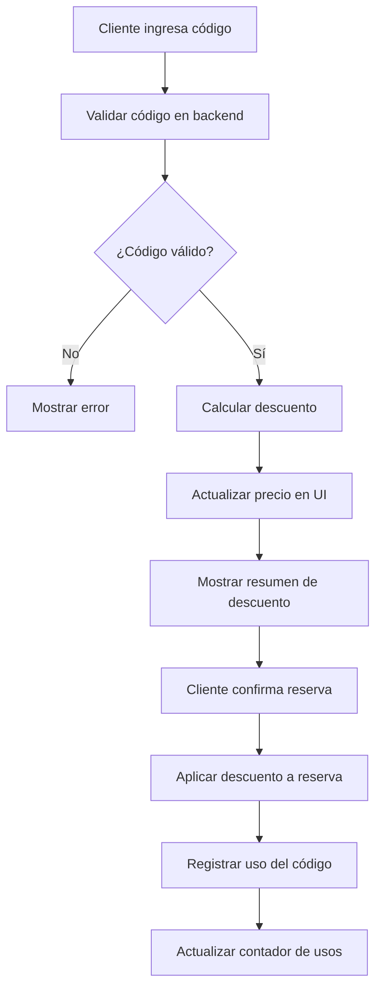

# Sistema de Códigos de Descuento

## Descripción General

El sistema de códigos de descuento permite a los clientes aplicar descuentos a sus reservas de canchas deportivas. Los códigos pueden tener diferentes tipos de descuentos (porcentaje o monto fijo) y restricciones de uso.

## Características Implementadas

### ✅ Funcionalidades Completadas

1. **Base de Datos**
   - Tabla `codigos_descuento` para almacenar códigos
   - Tabla `uso_codigos_descuento` para rastrear usos
   - Integración completa con PostgreSQL

2. **Backend API**
   - `POST /api/discounts/validar` - Validar código de descuento
   - `POST /api/discounts/aplicar` - Aplicar código a reserva
   - `POST /api/discounts/crear` - Crear nuevos códigos (admin)
   - `GET /api/discounts/listar` - Listar códigos (admin)

3. **Frontend**
   - Campo de código de descuento en modal de confirmación
   - Validación en tiempo real
   - Actualización automática de precios
   - Interfaz intuitiva y profesional

4. **Códigos Iniciales Configurados**
   - `RESERVATUSCANCHAS20` - 20% de descuento (máx. $10,000)
   - `BIENVENIDA15` - 15% de descuento (máx. $8,000)
   - `FIDELIDAD10` - 10% de descuento (máx. $5,000)

## Cómo Usar el Sistema

### Para Clientes

1. **Seleccionar Cancha**: Elige tu cancha y horario
2. **Llenar Datos**: Completa tus datos personales
3. **Aplicar Código**: 
   - Ingresa tu código de descuento en el campo correspondiente
   - Haz clic en "Aplicar" o presiona Enter
   - El sistema validará el código automáticamente
4. **Ver Descuento**: El precio se actualizará mostrando:
   - Precio original tachado
   - Monto del descuento
   - Precio final a pagar
5. **Confirmar Reserva**: Procede con el pago al precio con descuento

### Para Administradores

#### Crear Nuevos Códigos

```bash
# Usar la API directamente
curl -X POST http://localhost:3000/api/discounts/crear \
  -H "Content-Type: application/json" \
  -d '{
    "codigo": "NUEVO20",
    "descripcion": "Descuento especial del 20%",
    "porcentaje_descuento": 20.00,
    "monto_maximo_descuento": 15000,
    "fecha_inicio": "2024-09-16",
    "fecha_fin": "2024-12-31",
    "usos_maximos": 50
  }'
```

#### Listar Códigos Existentes

```bash
curl http://localhost:3000/api/discounts/listar
```

## Estructura de la Base de Datos

### Tabla `codigos_descuento`

| Campo | Tipo | Descripción |
|-------|------|-------------|
| id | SERIAL | ID único del código |
| codigo | VARCHAR(50) | Código único (ej: RESERVATUSCANCHAS20) |
| descripcion | TEXT | Descripción del descuento |
| porcentaje_descuento | DECIMAL(5,2) | Porcentaje de descuento |
| monto_maximo_descuento | INTEGER | Máximo descuento en pesos |
| fecha_inicio | DATE | Fecha de inicio de vigencia |
| fecha_fin | DATE | Fecha de fin de vigencia |
| usos_maximos | INTEGER | Límite de usos (null = ilimitado) |
| usos_actuales | INTEGER | Usos realizados |
| activo | BOOLEAN | Estado del código |

### Tabla `uso_codigos_descuento`

| Campo | Tipo | Descripción |
|-------|------|-------------|
| id | SERIAL | ID único del uso |
| codigo_id | INTEGER | Referencia al código usado |
| reserva_id | INTEGER | Referencia a la reserva |
| email_cliente | VARCHAR(255) | Email del cliente |
| monto_descuento | INTEGER | Monto descontado |
| monto_original | INTEGER | Precio original |
| monto_final | INTEGER | Precio final pagado |
| usado_en | TIMESTAMP | Fecha y hora del uso |

## Validaciones Implementadas

### Validaciones de Código
- ✅ Código existe y está activo
- ✅ Código está dentro del período de vigencia
- ✅ Código no ha excedido el límite de usos
- ✅ Email del cliente es válido

### Validaciones de Descuento
- ✅ Porcentaje de descuento aplicado correctamente
- ✅ Monto máximo de descuento respetado
- ✅ Precio final no puede ser negativo
- ✅ Precio final se actualiza en tiempo real

## Flujo de Aplicación de Descuento



## Configuración de Códigos

### Códigos Iniciales

| Código | Descuento | Máximo | Usos | Vigencia |
|--------|-----------|--------|------|----------|
| RESERVATUSCANCHAS20 | 20% | $10,000 | 100 | 1 año |
| BIENVENIDA15 | 15% | $8,000 | 50 | 1 año |
| FIDELIDAD10 | 10% | $5,000 | 200 | 1 año |

### Ejemplos de Uso

**Caso 1: Reserva de $28,000 con RESERVATUSCANCHAS20**
- Descuento: $28,000 × 20% = $5,600
- Precio final: $28,000 - $5,600 = $22,400

**Caso 2: Reserva de $50,000 con RESERVATUSCANCHAS20**
- Descuento calculado: $50,000 × 20% = $10,000
- Descuento aplicado: $10,000 (límite máximo)
- Precio final: $50,000 - $10,000 = $40,000

## Mantenimiento

### Scripts Disponibles

```bash
# Crear códigos de descuento iniciales
node scripts/setup-discount-codes.js

# Verificar estado de códigos
curl http://localhost:3000/api/discounts/listar
```

### Monitoreo

- Revisar usos restantes de códigos populares
- Verificar códigos próximos a expirar
- Monitorear efectividad de campañas de descuento

## Seguridad

- ✅ Códigos son únicos y no reutilizables por el mismo email
- ✅ Validación de fechas de vigencia
- ✅ Límites de uso por código
- ✅ Registro completo de usos para auditoría
- ✅ Precios se validan en backend

## Próximas Mejoras Sugeridas

1. **Panel de Administración**
   - Interfaz web para crear/editar códigos
   - Dashboard de estadísticas de uso
   - Gestión de códigos desde el admin

2. **Funcionalidades Avanzadas**
   - Códigos de descuento por tipo de cancha
   - Descuentos por primera reserva
   - Códigos de descuento por complejo específico
   - Integración con sistema de fidelización

3. **Reportes**
   - Análisis de efectividad de códigos
   - Reportes de uso por período
   - Métricas de conversión

## Soporte Técnico

Para problemas o consultas sobre el sistema de códigos de descuento:

1. Verificar logs del servidor para errores
2. Comprobar estado de la base de datos
3. Validar configuración de variables de entorno
4. Revisar conectividad con PostgreSQL

---

**Fecha de implementación**: 16 de septiembre de 2024  
**Versión**: 1.0.0  
**Estado**: ✅ Completamente funcional


